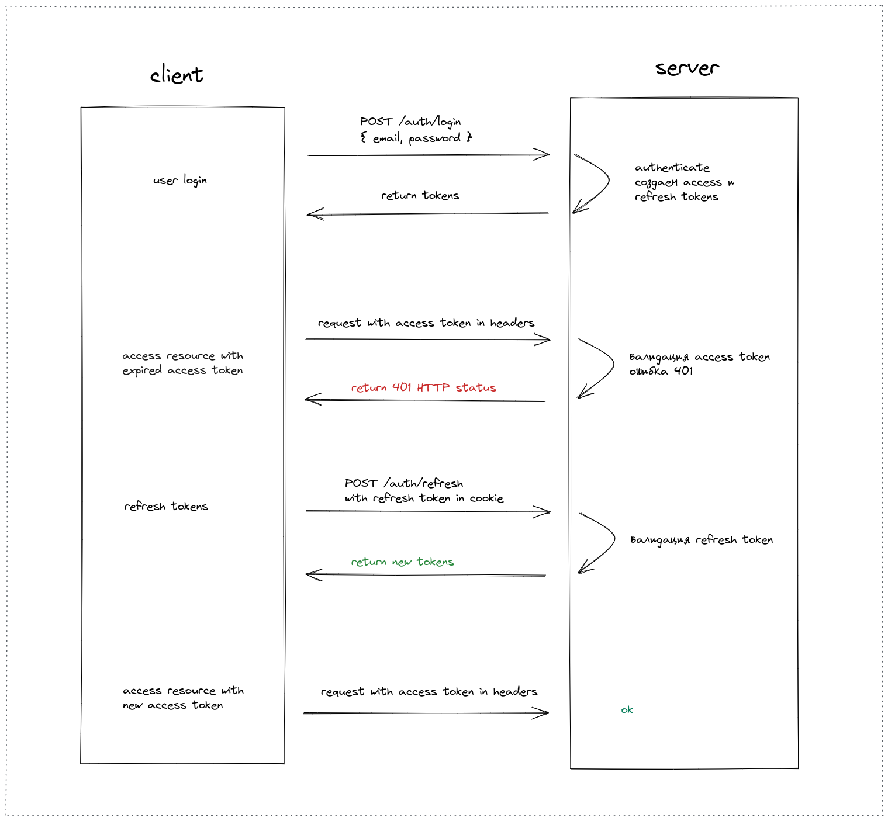

# Аутентификация/авторизация пользователей, client

Клиентская часть, построение архитектуры приложения Angular, более защищенная аутентификация/авторизация, используется два токена `Access token` и `Refresh token`

Back-end, REST API на Express, здесь [https://github.com/dmitriy-tka4/auth-secure-server](https://github.com/dmitriy-tka4/auth-secure-server)

## Техническое задание

* Angular
* Routing, HTTP client, forms, сервисы, взаимодействие с REST API
* SCSS
* Регистрация, авторизация пользователей, просмотр своего профиля, выход
* Валидация форм (`Reactive forms`)
* Используется два токена `Access token` и `Refresh token`, обновление токенов
* `Access token` пока хранится в localStorage, `Refresh token` передается с сервера в cookie (httpOnly)
* Клиент, в случае получения ответа от сервера о том, что  `Access token` истек (статус `401`), делает запрос на `/auth/refresh` для обновления обоих токенов, далее делает запрос к нужному роуту уже с новым `Access token` (реализовано в `AuthInterceptor`)
* Обработка ошибок (`ErrorInterceptor`)
* Для показа ошибок и сообщений добавлен `ngx-toastr`

Схема обновления токенов - на рисунке:

## Feedback

Писать на почту - dmitriy.tka4@gmail.com
